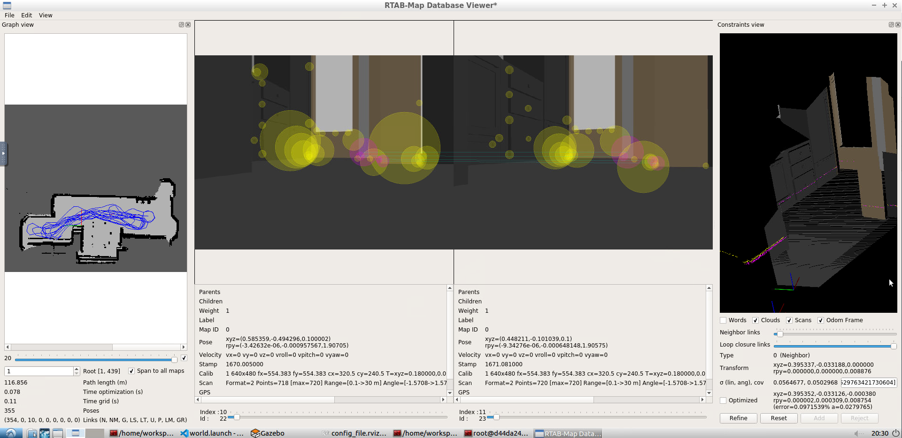
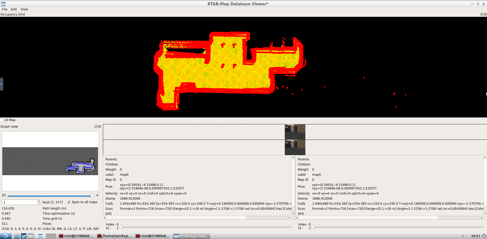

# Map My World
This project is the SLAM project of the Udacity Robotics Software Engineer Nanodegree. For the project, I applied the Real-Time Appearance Based Mapping (RTAB-Map) in ROS to perform SLAM in a simulated version of my home. My simulated home was too plain so, I added more detailed furniture to improve the algorithmns ability to map my home. The sqlite database containing my maps data is here: https://drive.google.com/file/d/1htAiearK8Tvg_ciYfPzP9NC6LuGTGMhN/view?usp=sharing




### Installation & Build
ROS Kinetic
The project was developed on Ubuntu 16.04 LTS with ROS Kinetic, Gazebo and catkin installed.

### Dependencies
The robot relies on the ```rtabmap_ros``` ROS package, which should be installed through ```apt-get```.

### Building the Workspace
Use ```catkin``` to build the packages from source. From the catkin workspace where you cloned the repo, run:

```catkin_make; source devel/setup.bash```

to build the workspace packages and add them to the paths of ROS.

### Running the Scripts
After the above steps, you should be able to run the commands below in separate terminals:

Launch the world in Gazebo:

```roslaunch my_robot world.launch```

Launch the teleop node for keyboard control:

```roslaunch my_robot teleop.launch```

If this doesn't work for you, you might need to change the permissions for the teleop_twist_keyboard.py file to make it an executable file.

Launch the RTAB-Map mapping node

```roslaunch my_robot mapping.launch```

Once you've looped around the environment a few times you can cancel the mapping operation in the terminal using ```Ctrl + C ``` and then it will tell you where the rtabmap.db is saved.

Then you can visualize the results using ```rtabmap-databaseViewer /root/ros/.ros/rtabmap.db```
